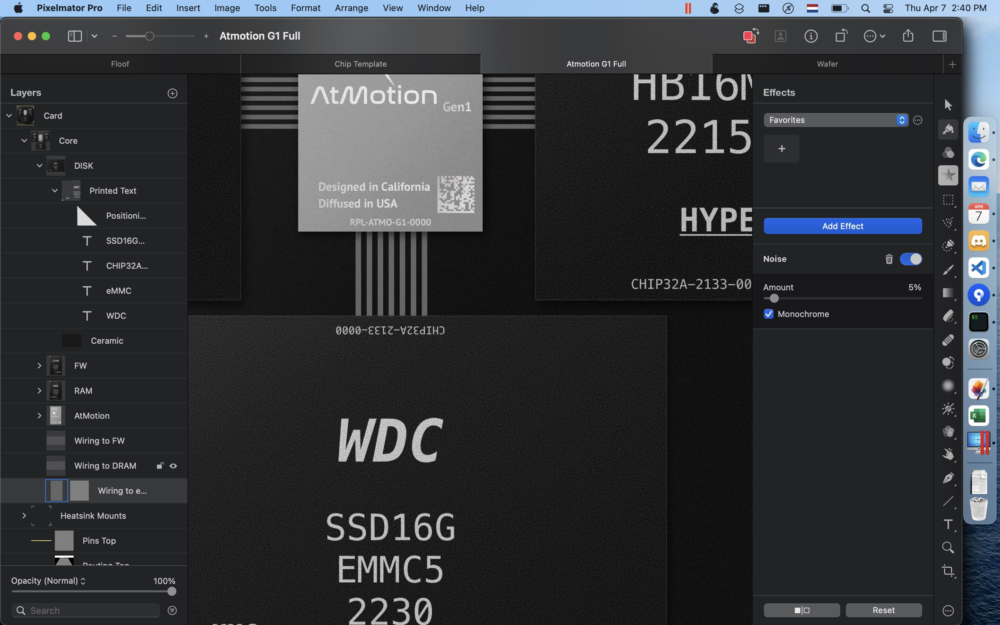

# Hello World!
D. Markarian

## Welcome to this website

[Lab report 1: UNIX 101](lab2-report.md)

[Lab report 2: Bug fixing](wk4-report.md)

[More Info](https://udxs.me/cse15l-lab-reports/more_info)

This is a proper paragraph of text.
Full of content. And here is a list:

- First
- Second
- Third

And remember to bake a cake with:


* [ ] Butter
* [ ] Flour
* [ ] Milk
* [ ] Eggs
* [x] Chocolate

`Inline Code` here.

```c
int main() {
    // A big code block with syntax highlighting.
}
```


---
*Horizontal rule* **above** 

> An important quote
> - Important Guy, 1920

1. This
2. That
3. and Such


| This  | is      | a   | table    |
| ----- | ------- | --- | -------- |
| Some  | Content |     | Possibly |
|       |         |     | Here     |
| Total |         |     | $75.30   |


	
	