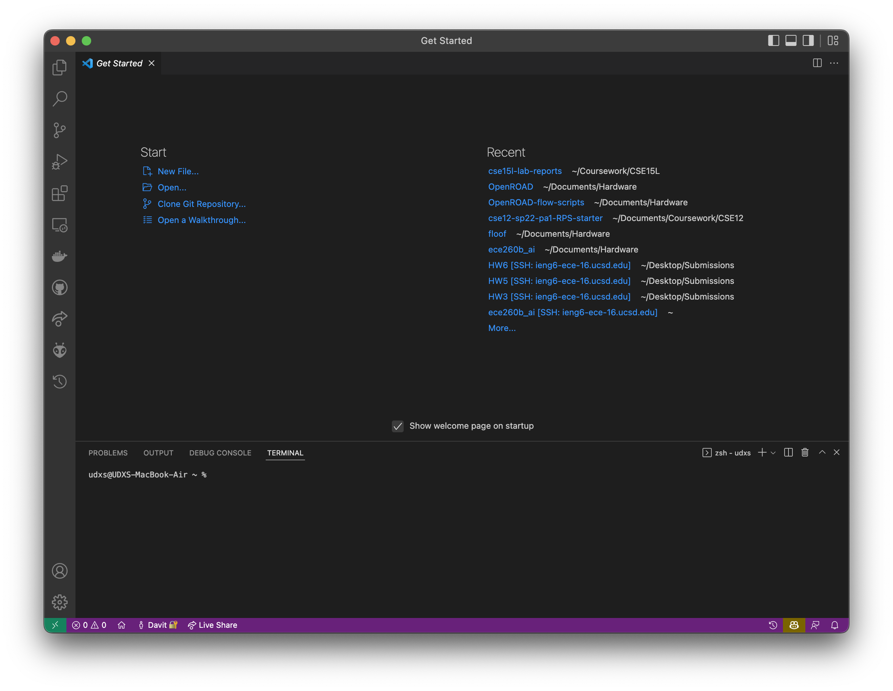
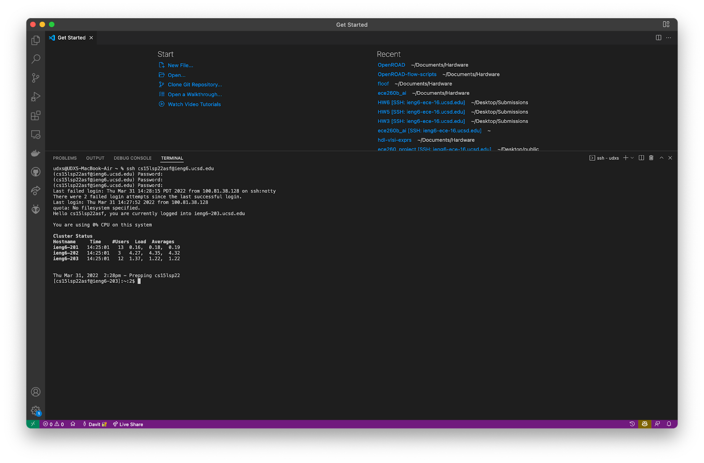
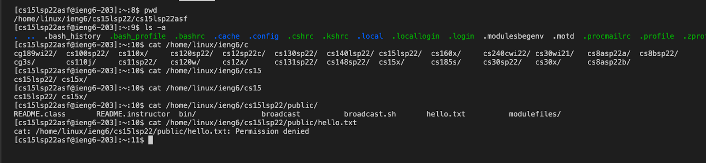
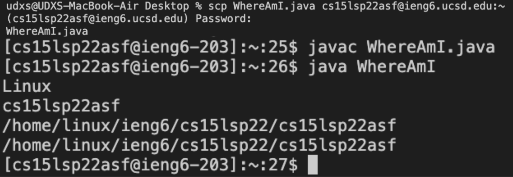
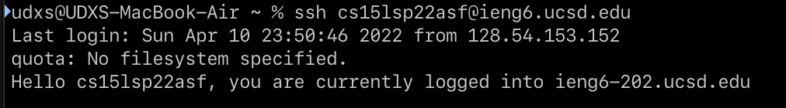
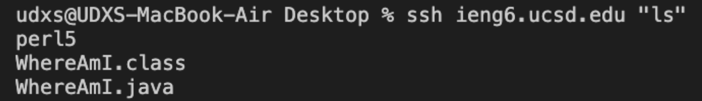

# Server UNIX 101
## Lab 2 Report by D. Markarian
---

Remoting into a UNIX or Linux machine is key to the workflow for so many engineers. Whether you need to access files from anywhere, run high-intensity workloads without needing a 50 lbs laptop, or collaborate with special software, remoting software is here to help.

## Client-side Setup
First, we need flexible terminal and development tools. The easiest and best too is [Visual Studio Code](https://code.visualstudio.com/) from Microsoft, which is a code editor with terminal features. It even supports working directly in remote environments but we aren't looking at that today. Install VS Code from [here](https://code.visualstudio.com/Download).


*VS Code's startup screen*

You should see the Terminal section in the bottom half of the app. If you don't, drag up from the colored bar at the bottom until it appears.

---

### Preparing `SSH`
We will be using the following command-line tools:

- `ssh` - **S**ecure **Sh**ell
- `ssh-keygen` - **SSH K**ey **G**enerator
- `scp` - **S**ecure **C**o**p**y

If you have a Linux machine or a Mac, you don't need to do anything. These tools come out of the box on these systems. If you have Windows, follow this [tutorial to install OpenSSH](https://docs.microsoft.com/en-us/windows-server/administration/openssh/openssh_install_firstuse) from Microsoft.

---
## Making a Connection
The `ssh` command has a simple format:
```sh
$ ssh user@hostname
```

For `ieng6`, we would type:

```sh
$ ssh cs15lsp22XXX@ieng6.ucsd.edu
```

where the `XXX` would be replaced with your unique 3-character user ID.

When you hit ⮐ **ENTER**, you'll be prompted to enter your password. If you enter it correctly, you'll see a welcome message followed by the server's terminal prompt.


*A terminal after logging into `ieng6` with `ssh`*

---
## Running some commands
You can now try some of the UNIX/Linux commands you already know, such as:

- `ls` - List Directory
- `cd` - Change Directory
- `cat` - Catalog file and output its contents
- `pwd` - Print Working Directory
- `du` - Disk Usage
- `hostname` - Server Hostname URL


*Some Commands Being Executed. Notice that there are some permission errors. UNIX/Linux rely on file permissions to allow multiple users to securely share a system.*

---
## Copying Files Around
### Using the `scp` tool
Sometimes, you need to copy files to and from your server. The easiest thing you can do is copy files around over the SSH connection. We can do this with a tool called `scp`, **S**ecure **C**o**P**y. Its command format is slightly more complex:

**Copying from the server to your machine**
```
$ scp user@hostname:/path/to/source local/path/to/destination
```

**Copying from your machine to the server**
```
$ scp local/path/to/src  user@hostname:/path/to/destination
```


*A file copied by `scp` being used by `javac`, another command line tool*

---
## Making Logins Easier
### Setting up SSH keys with `ssh-keygen`
By now, you might be tired of having to type your password in over and over again. It's no way to work. Fortunately, we have a way to tell the server to permanently trust out machine - by using *SSH keys*.

This is a two-step process. First, generate an SSH key by running the following:
```sh
$ ssh-keygen
```
For the most convenience, you can choose to not enter a key passphrase. This will make key files in `~/.ssh`, called `~/.ssh/id_rsa` and `~/.ssh/id_rsa.pub`. 

**NOTE**: Do not show the *randomart* output or the `id_rsa` files to anyone.

The next step is to copy the `id_rsa.pub` file to the server by running the following:
```sh
$ scp ~/.ssh/id_rsa.pub user@hostname:~/.ssh/authorized_keys
```

**NOTE**: Be careful to NOT accidentally copy the private key (`id_rsa`) to the server. This should stay on your client.


*Logging in to the server with passwordless `ssh`*

---
# Optimizing Remote Running

There's three great ways to further improve the efficency of your remote workflow.

1. Running commands within the `ssh` command. You can simply run `ssh "my command"`

*Running the `ls` command inline the `ssh` command*

2. Adding your username to your system `SSH` configuration as described [here](https://stackoverflow.com/a/10197697/2487620).

3. Running a full remote code editing environment with [VS Code *Remote over SSH*](https://code.visualstudio.com/docs/remote/ssh).