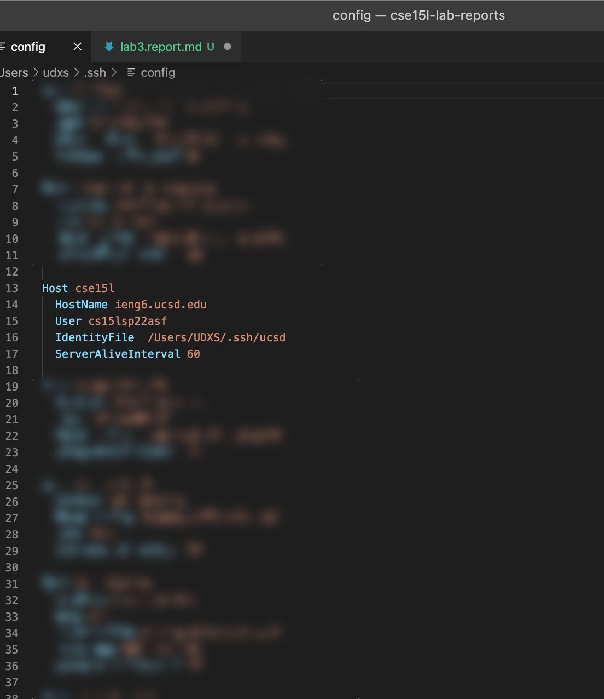
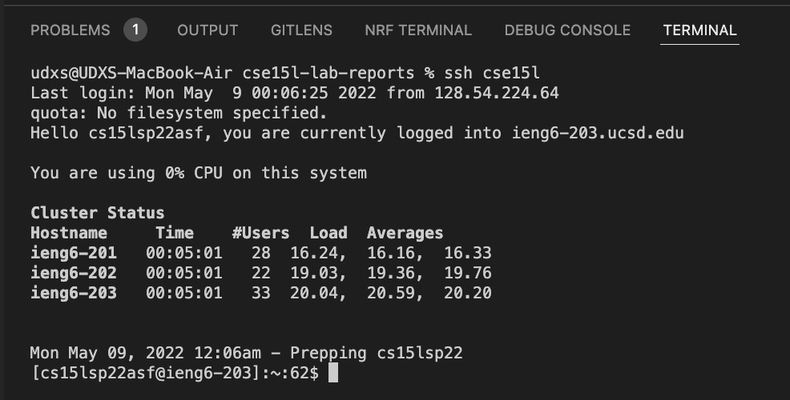
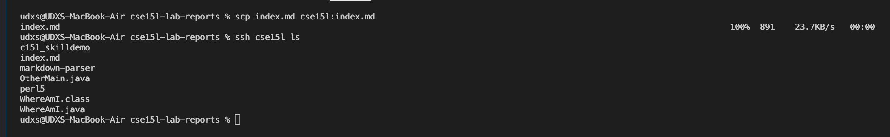
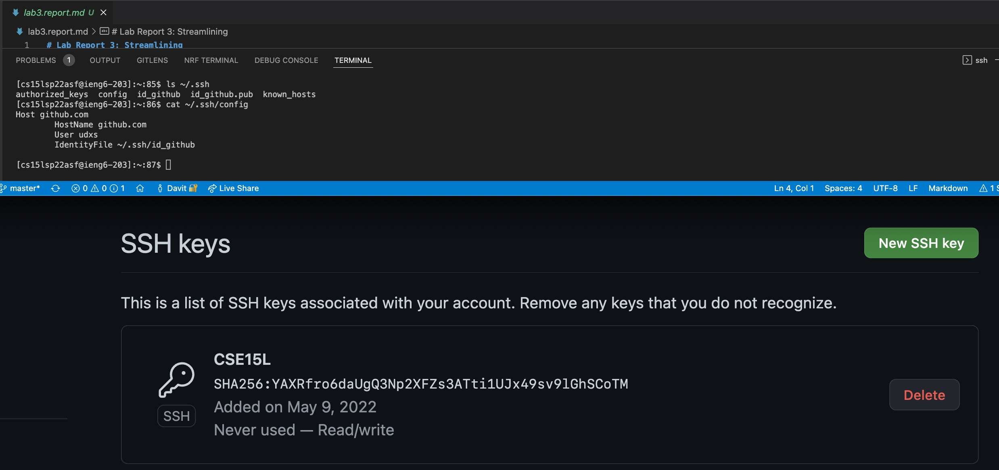
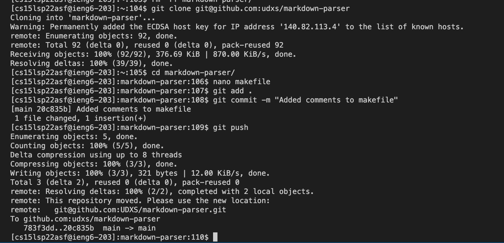
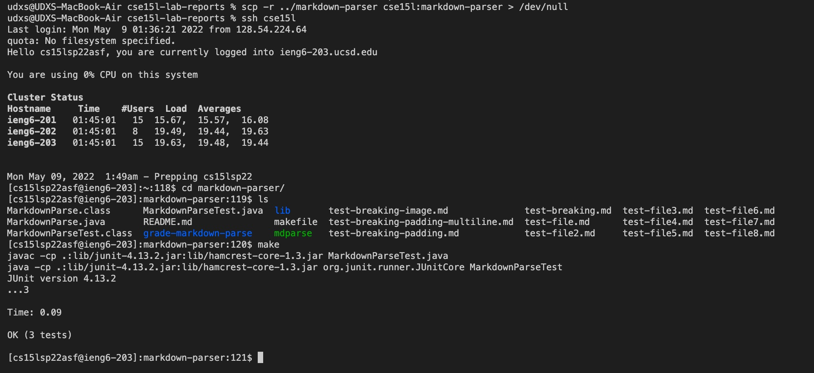
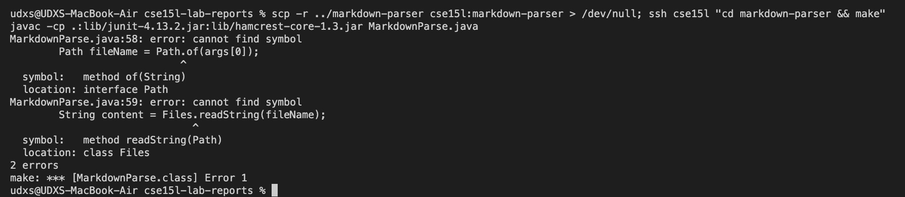

# Lab Report 3: Streamlining
D. Markarian

## Streamlining SSH 

*My SSH Configuration with `cse15l` alias*

*SSHing with the alias*

*SCPing with the alias

---

## GitHub Access from `ieng6`

*GitHub keypair setup* 

*Pushing a commit*

[**The Pushed Commit**](https://github.com/UDXS/markdown-parser/commit/20c835b0cfd318f6d7f6bd78801324260c322e02)

---

## Whole-Directory Copy with `scp -r`

*`scp -r` Markdown-parser directory Copy, Verify, and Test Execution*

*`scp` and `make` testing over `ssh` on one line*