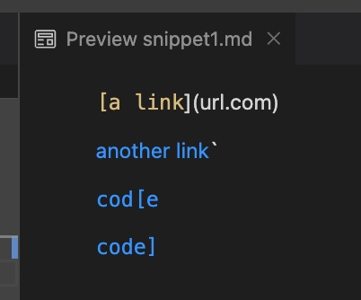
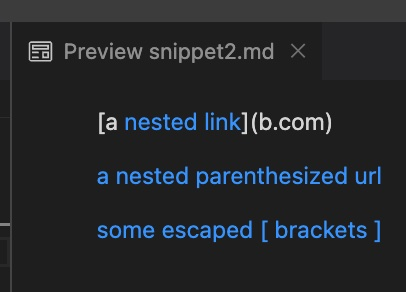
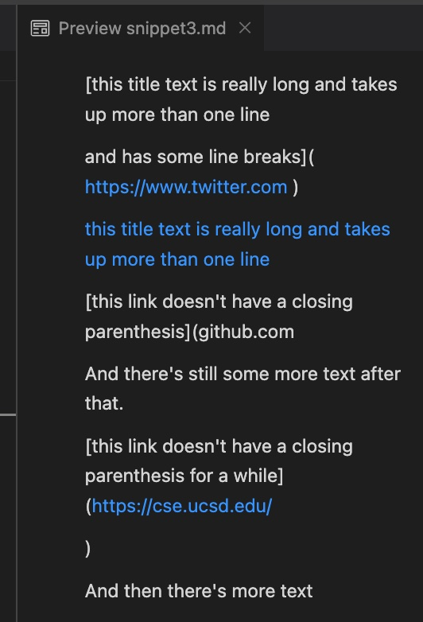
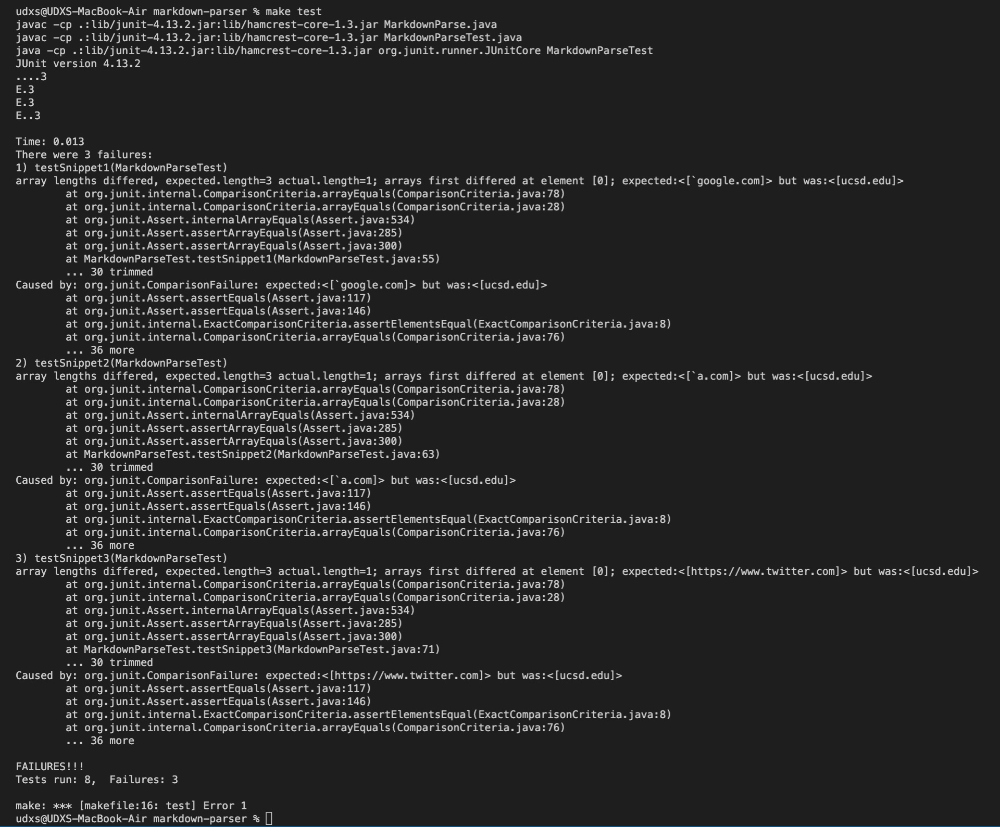
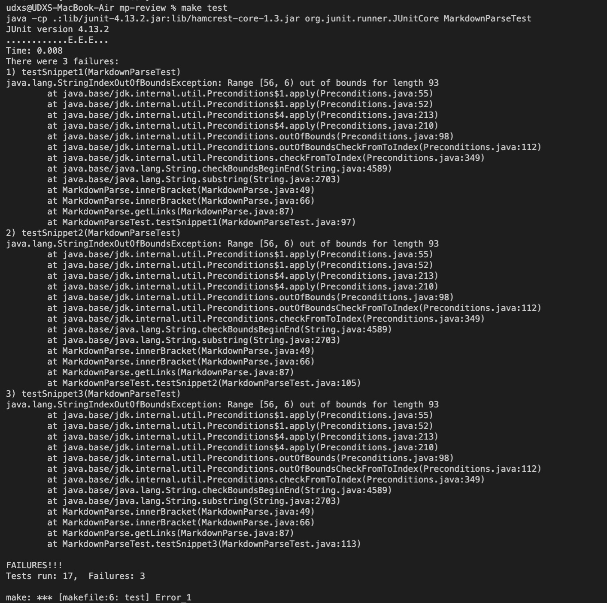

# Lab Report 4: Code Review
D. Markarian

[My Markdown Parser](https://github.com/UDXS/markdown-parser)

[Reviewed Markdown Parser](https://github.com/canitry/markdown-parser)


## Test Format
All my tests are formatted the same. They load Markdown source from a target
file and then execute it, performing an array assert equals. This code is shared for MarkdownTest.java in both my code and the reviewed code (with only `import` additions needed).

```java
    @Test
    public void testSnippet1() throws Exception {
        ArrayList<String> links = MarkdownParse.getLinks(Files.readString(Path.of("tests-lab4/snippet1.md")));
        String[] expected = {"`google.com", "google.com", "ucsd.edu"};

        assertArrayEquals(expected, links.toArray());
    }

    @Test
    public void testSnippet2() throws Exception {
        ArrayList<String> links = MarkdownParse.getLinks(Files.readString(Path.of("tests-lab4/snippet1.md")));
        String[] expected = {"`a.com", "a.com(())", "example.com"};
        
        assertArrayEquals(expected, links.toArray());
    }
    
    @Test
    public void testSnippet3() throws Exception {
        ArrayList<String> links = MarkdownParse.getLinks(Files.readString(Path.of("tests-lab4/snippet1.md")));
        String[] expected = {"https://www.twitter.com", "https://sites.google.com/eng.ucsd.edu/cse-15l-spring-2022/schedule", "https://cse.ucsd.edu/"};
        
        assertArrayEquals(expected, links.toArray());
    }
```
---

## Expectations
Tested with the latest version of VS Code and its Markdown Previewer.

### Snippet 1

Three links expected:


- ``` `google.com```
- ` google.com`
- ` ucsd.edu`


### Snippet 2

Three links expected:

- `a.com`
- `a.com(())`
- `example.com`

### Snippet 3

Three links expected:

- `https://www.twitter.com`
- `https://sites.google.com/eng.ucsd.edu/cse-15l-spring-2022/schedule`
- `https://cse.ucsd.edu/`
---

## My Test Results
All new JUnit snippets tests failed on my code.


They successfully ran but the JUnit log suggests that nested or backtick-ed links were wrongfully ignored by my parser.

## Reviewed's Test Results

All JUnit snippets tests failed on their code.


The JUnit logs suggest that their parser faulted on an exception on every one of these tests.
The stack trace suggests that one of their utility functions `innerBracket` was not able to cope with the nesting/multi-lining.

---
## Adaptability of My Code

### Snippet 1
I don't think this would be a simple change. The nature of the parser makes it hard to deal with the interleaved ``` `` ``` and `[]`. A more stream-oriented, stateful parser could be smarter about this. What we currently do is look for the brackets `]`, which may be (partially) surrounded in backticks and thus not be true brackets. There is no easy way to adapt to judge "candidacy."

### Snippet 2
Snippet 2 is in a similar situation of snippet 1, where nesting/interleaving of link/code constructs leads to us finding false candidates for links. The first line shows us that VS Code's parser is streaming characters and searching for the first complete construct it can find. It may maintain some stack to keep track of nesting but it is also possible that it just ignores that last `[` "construct starter." The parser would need to be rewritten in the same style.

### Snippet 3
This snippet features multi-line link constructs and shows that the VSCode parser does not consider a construct broken unless there is an empty line within it. We could write code to detect this more easily (perhaps by searching for `\n\n`) and thus disqualify it as a link candidate. The other phenomenon here is the automatic hyperlinking of `http://` or `https://` URLs like for `https://www.twitter.com`. We could implement this with a regex search.