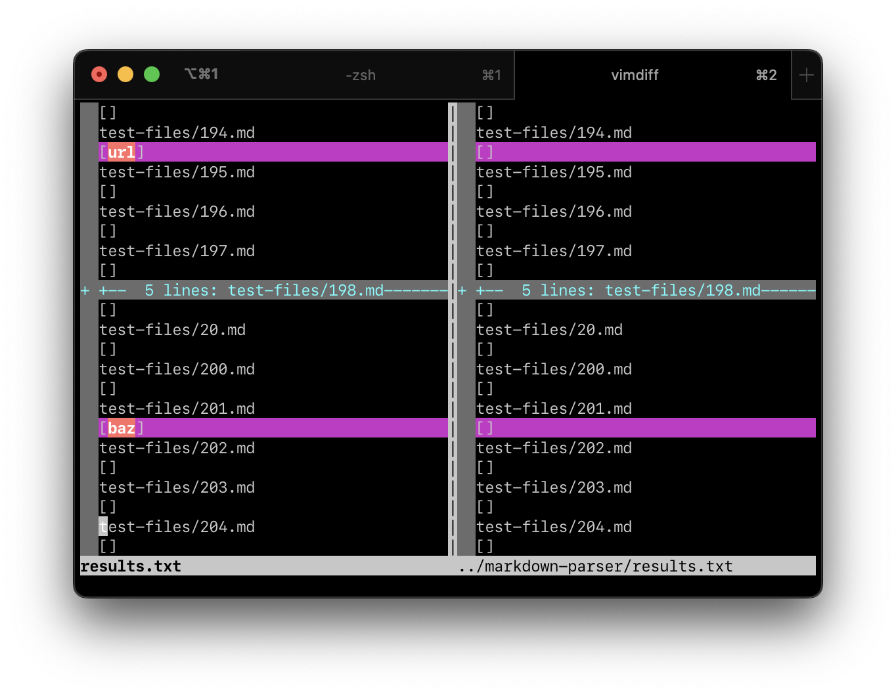
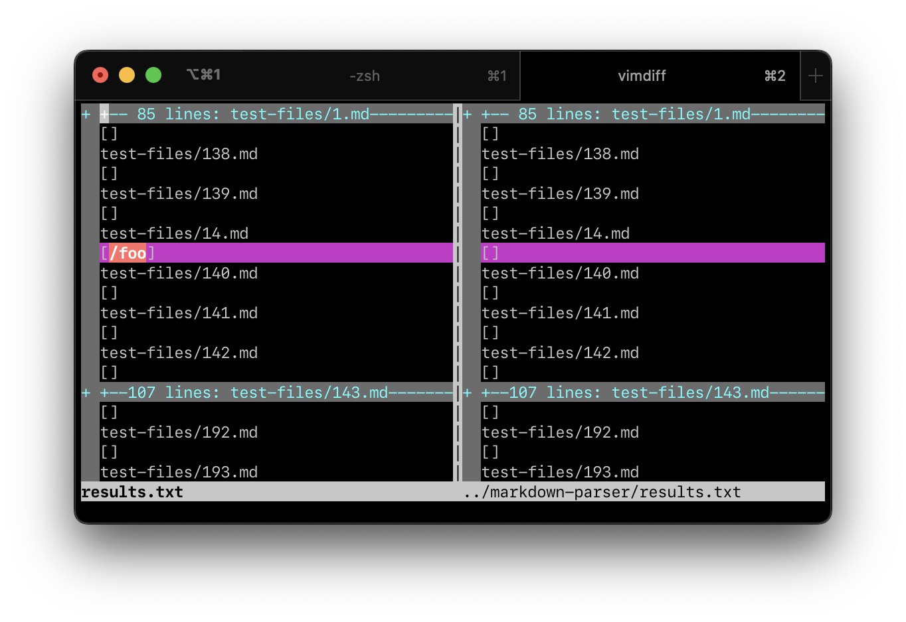
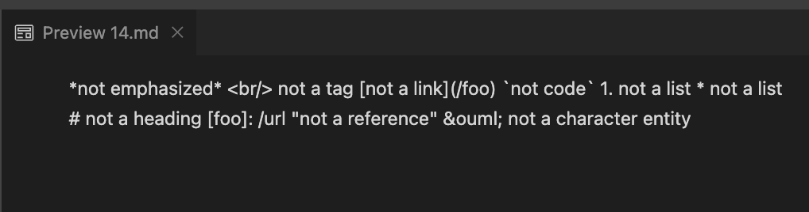
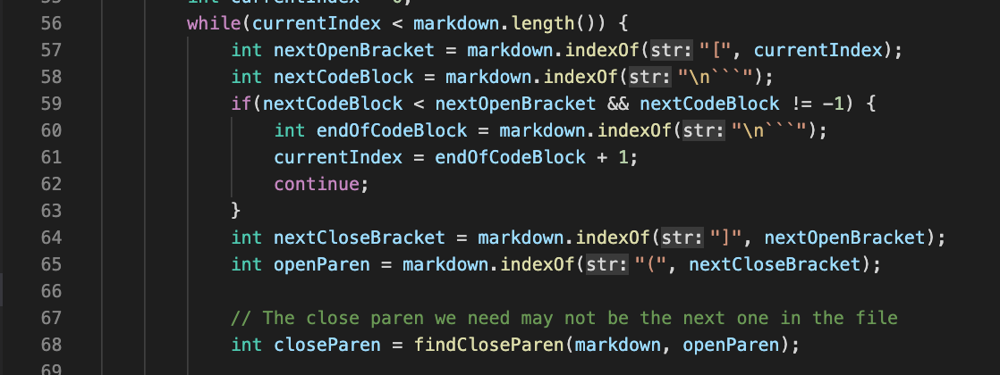
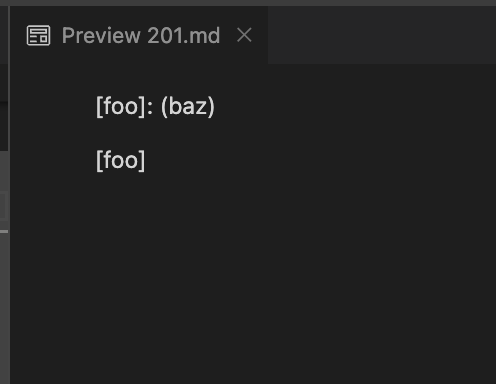

# Lab Report 5: Test Incoherencies
D. Markarian

I used [my Markdown Parser](https://github.com/UDXS/markdown-parser)
against the provided one.

To find the tests with different results, I used `vimdiff`
to aggregate results.

*vimdiff showing results for CSE15L-provided MarkdownParse (left) and my implementation (right).*

## Test 14
Test linked [here (`14.md`)](https://github.com/nidhidhamnani/markdown-parser/blob/main/test-files/14.md).

Here, my implementation returned `[]` while the provided one returned `[foo]`.

Visual Studio Code's preview shows no links. 

My implementation is correct because, in the case that the initial `[` is prefixed with a `\`, my implementation is set to not recognize the link,
in compliance with escaping rules in Markdown.

The CSE15L-provided implementation does not check for `\` backslash escapes
in any case. As such, it recognizes false links.

The fix can be implemented in this snippet. In the same way backticks are searched for, backslash escapes can be found and used to trigger a `continue`.

## Test 201
Test linked [here (`201.md`)](https://github.com/nidhidhamnani/markdown-parser/blob/main/test-files/201.md).

Here, my implementation returned `[]` while the provided one returned `[baz]`.

Visual Studio Code's preview shows no links. 

My implementation is correct because there are non-whitespace characters in between the `[]` and the `()` portions of the link candidate, thus disqualifying it from being a link. My implementation checks for non-whitespace characters in between the two and `continue`s.

The same snippet can be modified to fix this issue in the CSE15l-provided implementation. It can use regex to look for non-whitespace characters in the string between `nextCloseBracket` and `closeParen`. It could alternatively be done in `closeParen`'s implementation itself.