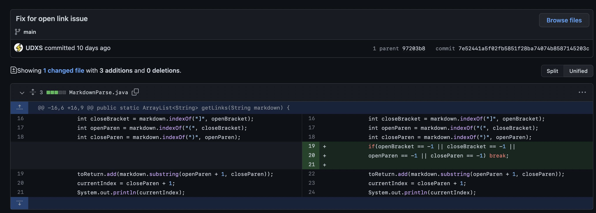
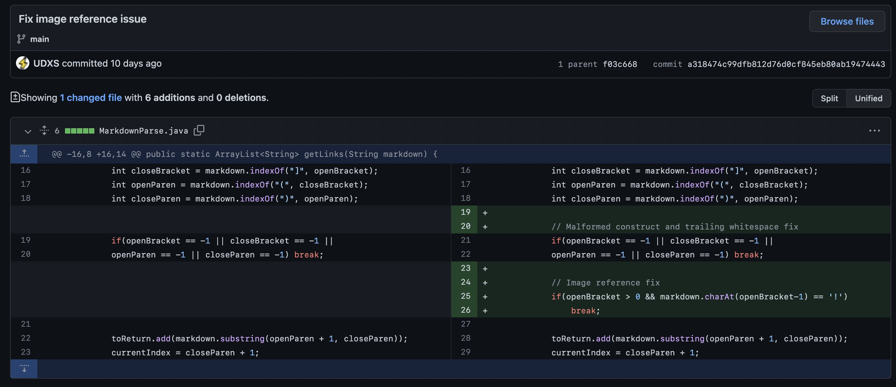
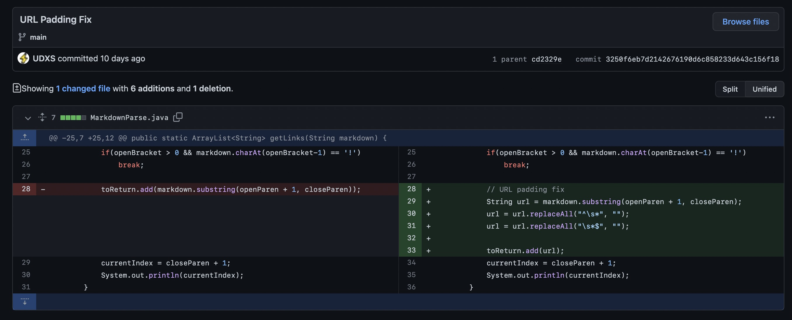

# Lab Report 2: Bug-fixing
D. Markarian

## Unclosed Link Freezeup
### Bug 1 [Fixed here](https://github.com/UDXS/markdown-parser/commit/7e52441a5f02fb5851f28ba74074b8587145203c).



*Change diff for Bug #1*


```md
Hello
[link1](https://something.com)

More text

[link4](https://something.edu)
[
```
[*Breaking test file*](https://github.com/UDXS/markdown-parser/blob/main/test-breaking.md)


```console
udxs@UDXS-MacBook-Air markdown-parser % java MarkdownParse test-breaking.md
36
79
36
79
36
79
36
79
36
79
36
79
36
79
36
79
36
...
```
*Broken output showing the sympton: infinite repeating output*

### Summary
The bug is that the link processing loop will not advance unless it finds the end of the Markdown link declaration. This causes it to loop repeatedly without advancing the stream index. The symptom is the printed repetition of the same current indicies infinitely, so the program never returns. The failing input file starts a link declaration with `[` but end the file without any of the other components of a link declaration present.

---

## Image reference misinterpretation
### Bug 2 [Fixed here](https://github.com/UDXS/markdown-parser/commit/a318474c99dfb812d76d0cf845eb80ab19474443).


*Change diff for Bug #2*

```md
Hello
[link1](https://something.com)

More text

[link 4](https://something.edu)

```
[*Breaking test file*](https://github.com/UDXS/markdown-parser/blob/main/test-breaking-image.md)

```console
udxs@UDXS-MacBook-Air markdown-parser % java MarkdownParse test-breaking-image.md
36
80
125
[https://something.com, https://something.edu, https://something.edu/image.png]
```
*Broken output showing the sympton: image references enumerated as normal link*

### Summary
The bug is that the link finding code does not consider whether the initial left bracket `[` is preceded by an exclamation mark `!`, which would constitute an image . This causes it to interpret what may be image references as normal links. The symptom is that we see an image reference to `https://something.edu/image.png` (as denoted in the failing file) listed as a link in the program's final output.

---


## URL padding remainder
### Bug 3 [Fixed here](https://github.com/UDXS/markdown-parser/commit/3250f6eb7d2142676190d6c858233d643c156f18).


*Change diff for Bug #3*

```md
Hello
[link1](https://something.com     )

More text

[link4](   https://something.edu          )
```
[*Breaking test file*](https://github.com/UDXS/markdown-parser/blob/main/test-breaking-padding.md)

```console
udxs@UDXS-MacBook-Air markdown-parser % java MarkdownParse test-breaking-padding.md 
41
97
[https://something.com     ,    https://something.edu          ]
```
*Broken output showing the sympton: image references enumerated as normal link*

### Summary
The bug is that the whitespace padding within the parentheses `( )` enclosing the URL are processed as part of the final URL. This whitespace padding is not to be considered as part of the URL according to [RFC 3986, Appendix C](https://datatracker.ietf.org/doc/html/rfc3986#appendix-C). This failure-inducing input file has two links with padding before and/or after the parentheses-enclosed URLs. The symptom we see is that the final output list of linked URLs has this same unnecessary/invalid spacing before and after each URL.